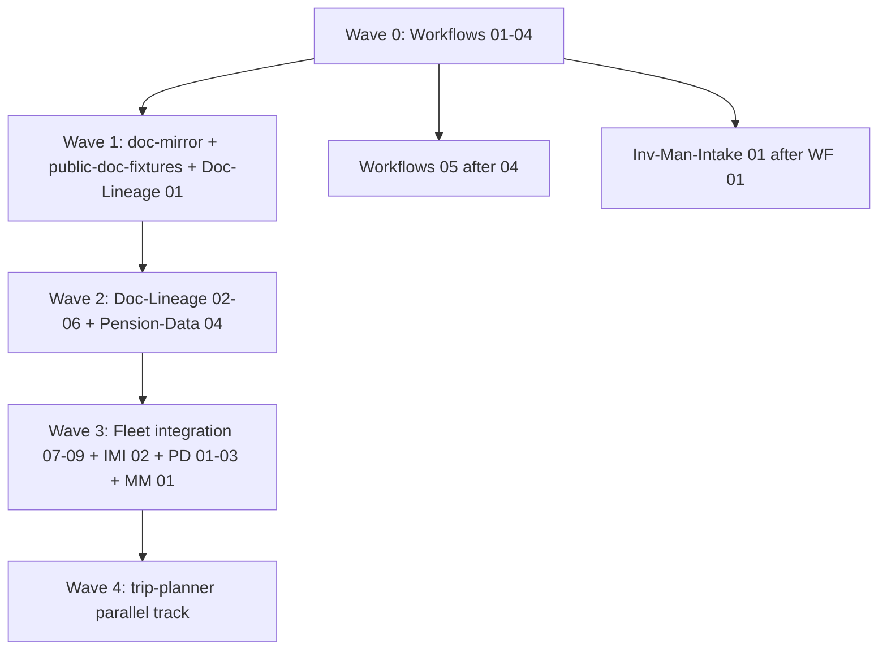

# B4 Filing Plan — Agent Issue Bodies from B2/B3 Dispositions

**Date:** 2026-09-04 · **Author:** Cursor (Composer) · **Status:** Draft bodies ready; do not file until lint pass  
**Inputs:** `artifacts/research/B2-gap-analysis.md`, `artifacts/research/B3-interop-architecture.md`, `artifacts/research/C-skill-curriculum.md`  
**Format:** `clones/Workflows/templates/consumer-repo/docs/AGENT_ISSUE_FORMAT.md`

---

## Summary

| Metric | Count |
|--------|------:|
| Issue bodies drafted | **33** |
| Repos touched | **8** |
| Excluded (not buildable now) | **9** candidates |
| Dedup (`gh issue list`) | **Skipped — `gh` not authenticated**; offline grep of `Issues.txt` found no title collisions for tracked-variable, document-mirror, output-substrate, mosaic-core, doc-mirror, public-doc-fixtures, Manager-Mosaic |

**JUDGMENT:** Tier 0 Workflows contracts are the only issues safe to file immediately without cross-repo ordering risk. Filing Doc-Lineage M1 before Workflows B2-003 lands wastes agent cycles on validators that do not exist yet. **Confidence:** High on dependency ordering; medium on trip-planner API-key issues (owner must supply Duffel/Maps credentials for live verification, not for CI fixtures).

**Re-run dedup before filing:** `gh issue list -R stranske/<repo> --state all --search '<keywords> in:title' --limit 50`

---

## Global filing order (waves)



---

## Per-repo ordered lists

### Workflows (`artifacts/issues/Workflows/`)

| Order | File | B2 ID | Title | File now? | Blocked by |
|------:|------|-------|-------|-----------|------------|
| 1 | `01-tracked-variable-v1-schemas.md` | B2-003 | tracked-variable/v1 + clause-variable schemas | **YES** | — |
| 2 | `02-mosaic-core-schemas.md` | B2-015 | mosaic-core pack | **YES** | — |
| 3 | `03-document-mirror-v1-schema.md` | B2-023 | document-mirror/v1 schema | **YES** | — |
| 4 | `04-output-substrate-v1.md` | B2-028 | output-substrate/v1 contract | **YES** | — |
| 5 | `05-excel-manifest-csv-export.md` | B2-032 | Excel manifest CSV export | After #4 merges | B2-028 |

**Dependencies:** None external. All four P0 issues are parallel-safe.

---

### doc-mirror (`artifacts/issues/doc-mirror/`) — **new repo**

| Order | File | B2 ID | Title | File now? | Blocked by |
|------:|------|-------|-------|-----------|------------|
| 1 | `01-doc-mirror-cli.md` | B2-024 | doc-mirror CLI | After WF #3 | B2-023 schema + repo creation on GitHub |

**Owner action:** Create `stranske/doc-mirror` from Template before filing (or bundle repo-create with first issue).

---

### public-doc-fixtures (`artifacts/issues/public-doc-fixtures/`) — **new repo**

| Order | File | B2 ID | Title | File now? | Blocked by |
|------:|------|-------|-------|-----------|------------|
| 1 | `01-public-doc-fixtures-manifest.md` | B2-037 | manifest catalog + LFS | **YES** (after repo exists) | GitHub repo + LFS policy (owner default #8: yes) |

**Owner action:** Confirm LFS budget for ~2 GB PDFs; create repo.

---

### Doc-Lineage (`artifacts/issues/Doc-Lineage/`)

| Order | File | B2 ID | Title | File now? | Blocked by |
|------:|------|-------|-------|-----------|------------|
| 1 | `01-fund-clause-vocabulary-v1.md` | B2-001 | fund-clause vocabulary | **YES** | — |
| 2 | `02-core-pipeline-m1-ingest.md` | B2-002 | M1 ingest pipeline | After #1 | B2-001 |
| 3 | `03-stranske-pdf-evidence-emission.md` | B2-004 | evidence-object emission | After WF #1, #2 | B2-003, B2-002 |
| 4 | `04-clause-blackline-engine.md` | B2-005 | blackline engine | After #2 | M1 parse |
| 5 | `05-edgar-ex10-lpa-harvest.md` | B2-007 | EDGAR EX-10 harvest | After public-doc-fixtures | B2-037, edgartools |
| 6 | `06-synthetic-mutation-harness.md` | B2-008 | mutation harness | After #2 | segmenter |
| 7 | `07-variable-fact-key-map.md` | B2-020 | fact_key map export | After #2, WF #2 | B2-002, B2-015 |
| 8 | `08-html-triple-link-resolver.md` | B2-025 | triple-link HTML | After WF #3 | B2-023 |
| 9 | `09-word-tracked-changes-export.md` | B2-034 | Word tracked-changes | After #2, #4 | B2-011 adopt, B2-002 |

---

### Manager-Mosaic (`artifacts/issues/Manager-Mosaic/`) — **new repo**

| Order | File | B2 ID | Title | File now? | Blocked by |
|------:|------|-------|-------|-----------|------------|
| 1 | `01-sqlite-html-importer.md` | B2-016 | SQLite + HTML importer | After WF #2 + producers | B2-015, PD/IMI/DL manifests |

**Owner action:** Create repo; confirm per-investment SQLite scope (owner default #5).

---

### Inv-Man-Intake (`artifacts/issues/Inv-Man-Intake/`)

| Order | File | B2 ID | Title | File now? | Blocked by |
|------:|------|-------|-------|-----------|------------|
| 1 | `01-consultant-section-ontology.md` | B2-010 | consultant section ontology | After WF #1 | B2-003 |
| 2 | `02-evidence-object-emitter.md` | B2-017 | evidence-object emitter | After WF #2 | B2-015 |
| 3 | `03-report-spec-json.md` | B2-031 | report-spec.json | After PD #2, WF #4 | B2-029, B2-028 |
| 4 | `04-ilpa-ddq-synthetic-fill.md` | B2-040 | ILPA DDQ synthetic | After #1 | B2-010 |

---

### Pension-Data (`artifacts/issues/Pension-Data/`)

| Order | File | B2 ID | Title | File now? | Blocked by |
|------:|------|-------|-------|-----------|------------|
| 1 | `01-evidence-entity-projection.md` | B2-018 | evidence + identity-map emit | After WF #2 | B2-015 |
| 2 | `02-renderer-shell-extraction.md` | B2-029 | renderer-shell factor | After WF #4 | B2-028 |
| 3 | `03-workspace-bundle-json.md` | B2-030 | workspace-bundle.json | After #2 | B2-029 |
| 4 | `04-calpers-ic-harvester.md` | B2-038 | CalPERS IC harvester | **YES** (parallel) | source_map |
| 5 | `05-ncsr-sample-ingest.md` | B2-042 | N-CSR sample | Parallel | edgartools |
| 6 | `06-replay-corpus-expansion.md` | B2-043 | replay corpus wiring | After #4 | B2-038 |
| 7 | `07-doc-lineage-staging-import.md` | B2-044 | Doc-Lineage var import | After DL #2 | B2-002 |

---

### trip-planner (`artifacts/issues/trip-planner/`)

| Order | File | B2 ID | Title | File now? | Blocked by |
|------:|------|-------|-------|-----------|------------|
| 1 | `01-duffel-flight-adapter.md` | B2-045 | Duffel adapter | **OWNER** (API account) | Duffel dev account for live smoke |
| 2 | `02-amtrak-gtfs-adapter.md` | B2-046 | Amtrak GTFS | **YES** | — |
| 3 | `03-fixture-eval-harness.md` | B2-047 | ranking eval harness | After #1, #2 | B2-045, B2-046 |
| 4 | `04-constraint-evaluation-envelope.md` | B2-048 | ConstraintEvaluation | **YES** | epic #519 contracts |
| 5 | `05-lodging-deep-link-capture.md` | B2-050 | lodging deep links | After provenance | B2-048 |

**Parallel track:** Does not block investment-document Tier 2–3.

---

## Excluded from this draft (not buildable now)

| B2 ID | Reason | Revisit when |
|-------|--------|--------------|
| B2-006 | Tier 4 — corpus rarity scorer | M2 + corpus stable |
| B2-009 | Tier 4 — full blackline-bundle renderer | B2-002 + B2-028 landed |
| B2-019 | Tier 4 — manager:cik_* projection (L effort) | identity-map/v1 consumers exist |
| B2-022 | **Owner access** — work-side mosaic contract capture | Owner exports work tool schema |
| B2-026 | **IT/Entra** — Graph delta ingest | IT approves scheduled job |
| B2-039 | Deprioritized until B2-037 manifest | public-doc-fixtures live |
| B2-049 | **Owner** — Google Routes (Maps Platform key) | API key provisioned |
| B2-051 | **Owner** — live TPP policy execution | TPP service deployed |
| B2-052 | Deferred — Rome2Rio partner approval uncertain | Partner OK |

---

## Safe to file immediately (lint pass only)

1. `Workflows/01` through `Workflows/04` (all P0 contracts)
2. `Doc-Lineage/01` (vocabulary — no Workflows dep for data file, but sync spec references WF #1 for CI validation)
3. `trip-planner/02` and `trip-planner/04` (fixture/contract only)
4. `Pension-Data/04` and `Pension-Data/05` (offline harvest lanes)

**Recommend filing Wave 0 first in one batch** so consumer sync picks up schemas before downstream issues start.

---

## Requires owner before filing

| Issue | Owner decision |
|-------|----------------|
| `doc-mirror/01` | Create GitHub repo; confirm mirror folder location (default #6: SharePoint sync OK) |
| `public-doc-fixtures/01` | LFS policy + first CalPERS PDF selection |
| `Manager-Mosaic/01` | Create repo; confirm work-side model capture timing |
| `trip-planner/01` | Duffel test account |
| Excluded B2-022 | Export work-side mosaic contracts |
| Excluded B2-049, B2-051 | API keys / TPP deploy |

---

## Lint / format gate before `gh issue create`

Run the fleet issue-format validator (or manual DoR checklist in AGENT_ISSUE_FORMAT.md §Pre-submit) on each body:

```bash
# Example — adjust path to fleet linter if available
for f in artifacts/issues/**/*.md; do
  [[ "$f" == *FILING_PLAN* ]] && continue
  [[ "$f" == *CHECKPOINT* ]] && continue
  echo "=== $f ==="
  # grep -q "## Acceptance Criteria" "$f" && grep -q "Deliberate-break" "$f" && echo OK || echo FAIL
done
```

Each drafted body includes: **Why** with `file:line`, **Tasks** with paths, **Acceptance Criteria** with named test + deliberate-break, **Non-Goals** anti-scaffold clause.

---

## Filing command template (owner/engine — not run in B4 offload)

```bash
REPO=stranske/Workflows
BODY=artifacts/issues/Workflows/01-tracked-variable-v1-schemas.md
gh issue create -R "$REPO" \
  --title "[P0] Add tracked-variable/v1 + clause-variable satellite schemas (B2-003)" \
  --body-file "$BODY" \
  --label "agents:auto-pilot"
```

---

## Artifact index

```
artifacts/issues/
├── FILING_PLAN.md          ← this file
├── B4-issue-drafting.CHECKPOINT.md
├── Workflows/              (5 issues)
├── Doc-Lineage/            (9 issues)
├── doc-mirror/             (1 issue)
├── public-doc-fixtures/    (1 issue)
├── Manager-Mosaic/         (1 issue)
├── Inv-Man-Intake/         (4 issues)
├── Pension-Data/           (7 issues)
└── trip-planner/           (5 issues)
```

---

*Dedup note: `gh auth status` reported not logged in during B4; re-run `gh issue list` dedup at filing time. No `artifacts/dossiers/<Repo>.md` files created per offload rules.*
