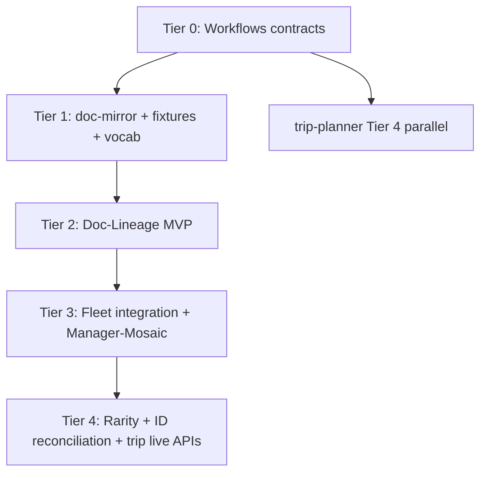

# B2 — Gap Analysis and Candidate Disposition

**Date:** 2026-09-04 · **Author:** Cursor (Composer) · **Status:** Phase B2 synthesis across R1–R7

## Executive summary

Seven research briefs produced **80 raw candidates**; after deduplication and merge of overlapping items (Doc-Lineage pipeline, CalPERS harvester, evidence emission, Workflows contract packs), **52 actionable candidates** and **27 explicit rejects** remain (79 rows in `artifacts/candidates.jsonl`).

**JUDGMENT (evaluator stance):** The fleet is not missing ideas — it is missing **three horizontal substrates** that every vertical brief assumes: (1) conformant **evidence and variable contracts** in Workflows, (2) a **document mirror + static output renderer** for the no-install work PC, and (3) a **public/synthetic corpus manifest** so home development does not re-download per repo. Doc-Lineage is the largest greenfield product repo but is scaffold-only today (`clones/Doc-Lineage/README.md`); Pension-Data is the only repo emitting conformant `run-contract/v1` and `artifact-manifest/v1` per `00-INDEX.md` §2.2; Inv-Man-Intake and Manager-Database carry the richest extraction logic but emit page-pointer strings, not `evidence-object/v1` files (`artifacts/dossiers/Inv-Man-Intake.md` §5, `Pension-Data.md` §5).

**Confidence:** High on disposition ordering; medium on effort estimates for Doc-Lineage M2 extraction accuracy without labeled fund-LPA spans. **Would change my mind:** Owner provides a labeled 20-doc evaluation set, or Backstop documents an export API with immutable IDs (would reopen B2-R11).

---

## 1. Fleet gap synthesis

### 1.1 What exists (dossier evidence)

| Capability | Best current owner | Evidence | Gap |
|------------|-------------------|----------|-----|
| Run envelopes | Pension-Data | `backplane_emitter.py`; dossier §5 | 1/6 repos conformant (`00-INDEX.md` §2.2) |
| Evidence locators | Pension-Data | `build_evidence_reference` with page/excerpt | No standalone `evidence-object/v1` files |
| Entity merge | Pension-Data | `merge_canonical_entities` | `manager:` integer vs string collision (`00-INDEX.md` §2.1) |
| Holdings diff | Manager-Database | `diff_holdings.py` | Narrative report diff absent |
| Static HTML review | Pension-Data | `apps/web/` + `workspace.json` | Not generalized fleet-wide (R5) |
| PDF parse scaffold | Workflows | `stranske_pdf_extract` contract | DESIGN scaffold; no Doc-Lineage consumer |
| Trip ranking | trip-planner | `business.py`, contracts epics #519–525 | **No concrete SourceAdapters** — fixtures only (`trip-planner.md`) |
| Policy evaluation | Travel-Plan-Permission | planner integration fixtures | Live TPP disabled in trip-planner README |

### 1.2 Cross-brief dependencies

R1 (legal decomposition) and R2 (consultant diffing) converge on **one Doc-Lineage engine** with separate vocabulary files — not separate repos. R3 (mosaic) consumes R1/R2 **tracked variables** as `fact_key` inputs. R4 (document mirror) is prerequisite for work-PC one-click links assumed by R1–R3 and R5. R5 (output substrate) generalizes Pension-Data's bundle pattern for all HTML products. R6 (corpora) feeds R1/R2 golden tests and should not duplicate Pension-Data PPD/5500 or Manager-Database 13F lanes. R7 (trip planning) is **orthogonal** to the investment-document stack except for shared output-substrate delivery.

---

## 2. Disposition table

Disposition values: `extend:<repo>` | `new-repo:<name>` | `adopt:<tool>` | `reject`.

### 2.1 Workflows contracts (foundation)

| ID | What | Disposition | Effort | Prereq | Rationale |
|----|------|-------------|--------|--------|-----------|
| B2-003 | tracked-variable/v1 + clause-variable/v1 schemas | extend:Workflows | S | — | Unifies R1 clauses and R2 report sections; Workflows already owns `evidence-object/v1` validator (`00-INDEX.md` §2.2) |
| B2-015 | mosaic-core pack (Fact, Discrepancy, ThesisClaim, ThesisCheck) | extend:Workflows | S | — | No repo emits thesis/discrepancy wire format; PROV/RDF rejected (R3) |
| B2-023 | document-mirror/v1 schema | extend:Workflows | S | — | Pension-Data has checksum supersession (`artifacts.py`) but no cross-system manifest |
| B2-028 | output-substrate/v1 contract | extend:Workflows | M | artifact-manifest/v1 | Stops hand-built HTML drift (R5); Pension-Data `apps/web/` is embryonic standard |
| B2-032 | Excel manifest CSV export | extend:Workflows | S | B2-028 | Native work-PC tables without renderer |

### 2.2 Doc-Lineage (largest product gap)

| ID | What | Disposition | Effort | Prereq | Rationale |
|----|------|-------------|--------|--------|-----------|
| B2-001 | Fund-clause vocabulary v1 (~25 keys) | extend:Doc-Lineage | S | — | Stable cross-manager join key; ILPA/CUAD seed (R1) |
| B2-002 | Core pipeline: ingest → extract → diff → HTML | extend:Doc-Lineage | L | B2-001 | Repo is scaffold-only; README waits for R1/R2 |
| B2-004 | stranske_pdf_extract → evidence-object/v1 | extend:Doc-Lineage | M | B2-003 | Fleet provenance target per Workflows DESIGN |
| B2-005 | Clause-alignment blackline engine | extend:Doc-Lineage | M | M1 parse | Section-ID first, semantic fallback (R1 §1.3) |
| B2-006 | Corpus rarity scorer | extend:Doc-Lineage | M | M2 + corpus | "Unusual" = low normalized-value frequency |
| B2-007 | EDGAR EX-10 LPA harvest | extend:Doc-Lineage | M | edgartools | Public legal lineage without proprietary LPAs |
| B2-008 | Synthetic mutation harness | extend:Doc-Lineage | M | segmenter | Deterministic diff ground truth (R6) |
| B2-009 | blackline-bundle.json + diff view | extend:Doc-Lineage | L | B2-002, B2-028 | R5 renderer profile for consultant/legal products |
| B2-020 | Variable IDs → fact_key map | extend:Doc-Lineage | M | B2-002, B2-015 | Feeds Manager-Mosaic discrepancy engine |
| B2-025 | HTML triple-link resolver | extend:Doc-Lineage | S | B2-023 | mirror + Backstop/SharePoint + page anchor (R4) |
| B2-034 | Word tracked-changes export | extend:Doc-Lineage | M | B2-011, B2-002 | Counsel sign-off artifact (R2, R5) |

### 2.3 Document mirror (R4)

| ID | What | Disposition | Effort | Prereq | Rationale |
|----|------|-------------|--------|--------|-----------|
| B2-024 | doc-mirror CLI | new-repo:doc-mirror | S | — | Reuses Pension-Data supersession *pattern*, not SQLAlchemy |
| B2-026 | Graph delta ingest (batch) | extend:doc-mirror | M | Entra + IT | MCP wrong for bulk; scheduled job (R4 §3.3) |
| B2-027 | sharepoint-mcp probe | adopt:sharepoint-mcp | S | Entra | Interactive discovery only; not runtime reader |

### 2.4 Manager mosaic (R3)

| ID | What | Disposition | Effort | Prereq | Rationale |
|----|------|-------------|--------|--------|-----------|
| B2-016 | Manager-Mosaic SQLite + HTML | new-repo:Manager-Mosaic | M | B2-015 | Fleet lacks cross-source join; work tool near-complete — port contracts, not UX (R3 §7) |
| B2-022 | Work-side mosaic contract capture | new-repo:Manager-Mosaic | S | owner access | Docs-only charter before reimplementation |
| B2-021 | sqlite-vec hybrid search | adopt:sqlite-vec | S | B2-016 | Optional lane; fact_key covers most discrepancies |

### 2.5 Extend existing repos

| ID | What | Disposition | Effort | Prereq | Rationale |
|----|------|-------------|--------|--------|-----------|
| B2-017 | evidence-object emitter | extend:Inv-Man-Intake | M | B2-015 | Largest provenance gap: `evidence_refs` are strings (`Inv-Man-Intake.md` §5) |
| B2-010 | Consultant section ontology | extend:Inv-Man-Intake | M | B2-003 | Standard Element Library is stub (`standard_element_library.md`) |
| B2-031 | report-spec.json | extend:Inv-Man-Intake | S | B2-029 | OnePagerModel already renderer-oriented |
| B2-040 | ILPA DDQ synthetic fill | extend:Inv-Man-Intake | S | B2-010 | DDQ tests without manager data |
| B2-018 | Evidence + entity projection | extend:Pension-Data | M | B2-015 | Richest `build_evidence_reference`; merge export exists |
| B2-029 | Shared renderer-shell | extend:Pension-Data | M | B2-028 | Factor `apps/web/` to Template (R5) |
| B2-030 | workspace-bundle.json | extend:Pension-Data | S | B2-029 | Tabular drilldown pattern proven |
| B2-038 | CalPERS IC harvester | extend:Pension-Data | M | source_map | CalPERS seeded but IC items not crawled (R6) |
| B2-042 | N-CSR sample ingest | extend:Pension-Data | M | edgartools | Audited financials; don't parallel CAFR crawler |
| B2-043 | Replay corpus expansion | extend:Pension-Data | S | B2-038 | Wires public PDFs into 1,382-test gate |
| B2-044 | Doc-Lineage variable staging import | extend:Pension-Data | S | B2-002 | Consultant vars beside actuarial facts — consume, don't duplicate diff |
| B2-019 | manager:cik_* projection | extend:Manager-Database | L | identity-map | Integer `manager_id` blocks fleet joins (`00-INDEX.md` §5.1) |
| B2-039 | Form ADV bulk ingest | extend:Manager-Database | M | CRD list | **Deprioritize** until B2-037 manifest exists (R6 evaluator) |
| B2-045–051 | Trip adapters + TPP wire-up | extend:trip-planner | S–M | varies | Architecture ahead of data; Duffel+GTFS first (R7) |
| B2-052 | Rome2Rio adapter | extend:trip-planner | M | partner | Defer — approval uncertain |

### 2.6 Corpora infrastructure (R6)

| ID | What | Disposition | Effort | Prereq | Rationale |
|----|------|-------------|--------|--------|-----------|
| B2-037 | public-doc-fixtures manifest | new-repo:public-doc-fixtures | M | artifact-manifest/v1 | Single golden catalog; enables Claude Code web without per-repo blob duplication |
| B2-041 | Oaktree Marks memo slice | adopt:oaktree-memos | S | B2-037 | Manager letter blackline; legally citable public source |

### 2.7 Adopted libraries (home build lane)

| ID | Tool | Disposition | Work PC | Rationale |
|----|------|-------------|---------|-----------|
| B2-011 | python-redlines | adopt:python-redlines | No install — pre-run DOCX | Highest-fidelity DOCX blackline (R2) |
| B2-012 | Docling | adopt:docling | No install — ship JSON/HTML | Default PDF segmenter; home/CI only |
| B2-013 | sentweave | adopt:sentweave | No install | Vecalign-style alignment after segmentation |
| B2-014 | pdfdelta | adopt:pdfdelta | Optional annotated PDF output | Visual layer atop aligned text |
| B2-033 | Quarto | adopt:quarto | Single self-contained HTML file | Board one-offs; SharePoint-friendly (R5) |
| B2-035 | stlite | adopt:stlite | Heavy WASM; demo lane only | PAEM has stlite entry (`web/index.html`) but README disclaims; not publish path until work probe |
| B2-036 | DuckDB-WASM | adopt:duckdb-wasm | Inside renderer bundle | Optional pivot widget; ~34 MB |

### 2.8 Rejects (summary)

27 candidates rejected — see `candidates.jsonl` IDs B2-R01 through B2-R27. Themes: commercial legal AI (B2-R02), AGPL/heavy NLP backends (B2-R01), MCP/Backstop as runtime plan dependency (B2-R10, B2-R11), Node BI frameworks (B2-R12–R13), hand-built HTML status quo (B2-R15), FINRA/paid data APIs (B2-R17–R18), OTA/scraper flight and lodging (B2-R21–R24), greenfield mosaic rebuild (B2-R25), Manager-Database as owner mosaic hub (B2-R26), decommissioned Amadeus tier (B2-R27).

---

## 3. Dependency-ordered roadmap

### Tier 0 — Contracts (weeks 1–2, parallel)

No product code ships without these. All downstream repos import from Workflows.

1. **B2-003** tracked-variable/v1 + clause-variable/v1
2. **B2-015** mosaic-core schemas
3. **B2-023** document-mirror/v1
4. **B2-028** output-substrate/v1

**Gate:** Workflows validators pass on golden fixtures; `identity-map-conventions.md` amended to federated emitters (R3 default).

### Tier 1 — Substrate tools (weeks 2–4)

5. **B2-024** doc-mirror CLI + synthetic fixture
6. **B2-037** public-doc-fixtures manifest (manifest first, blobs in LFS)
7. **B2-001** fund-clause vocabulary
8. **B2-029** renderer-shell extraction from Pension-Data (can start once B2-028 drafted)

**Gate:** One synthetic mirror validates; one public CalPERS PDF registered in manifest.

### Tier 2 — Doc-Lineage MVP (weeks 4–10)

9. **B2-012** Docling adapter → **B2-002** M1 ingest
10. **B2-011** python-redlines path for DOCX golden pair
11. **B2-013** sentweave alignment → **B2-005** blackline → **B2-004** evidence emission
12. **B2-010** consultant section ontology (parallel)
13. **B2-038** CalPERS harvester → golden YoY pair
14. **B2-008** synthetic mutations for CI
15. **B2-025** triple-link HTML

**Gate:** CalPERS 2025→2026 trust-level review blacklines with >90% section pairing on manual audit (R2 objection test).

### Tier 3 — Fleet integration (weeks 8–14)

16. **B2-017** Inv-Man-Intake evidence-object emitter
17. **B2-018** Pension-Data evidence projection + **B2-044** staging import
18. **B2-030** workspace-bundle + **B2-031** report-spec profiles
19. **B2-016** Manager-Mosaic importer (manifests from siblings)
20. **B2-020** Doc-Lineage → fact_key map
21. **B2-007** EDGAR LPA harvest (legal lineage)

**Gate:** One investment mosaic bundle ingests Pension-Data run + Inv-Man-Intake manifest + Doc-Lineage variables; static HTML opens with one-click page links.

### Tier 4 — Ambitious / deferred (weeks 12+)

22. **B2-006** corpus rarity
23. **B2-009** blackline-bundle full renderer profile
24. **B2-019** Manager-Database canonical ID projection (large)
25. **B2-026** Graph delta sync (needs IT)
26. **B2-039** ADV ingest (after manifest consumers exist)
27. **B2-045–051** trip-planner vertical slice (parallel track; does not block Tier 2–3)

---

## 4. Ready-made tools to adopt now

Tools run on the **home build lane** (Python, CI, Claude Code web). Work PC receives **static outputs only** unless noted.

| Tool | Install (home) | Work PC | Use | Candidate |
|------|----------------|---------|-----|-----------|
| **Docling** | `pip install docling` | No — ship parsed JSON + HTML | PDF/DOCX segmentation | B2-012 |
| **python-redlines** | `pip install python-redlines` | No — ship `.docx` + HTML | DOCX tracked changes | B2-011 |
| **sentweave** | `pip install sentweave` | No | Block alignment across layout drift | B2-013 |
| **pdfdelta** | `pip install pdfdelta` | Optional PDF with annotations | Visual blackline layer | B2-014 |
| **edgartools** | `pip install edgartools` | No | SEC EX-10/N-CSR harvest | B2-007, B2-042 |
| **sqlite-vec** | `pip install sqlite-vec` | No — embedded in `.sqlite` | Mosaic hybrid search | B2-021 |
| **Quarto** | `brew install quarto` or conda | **No install** — open single `.html` | Board one-off reports | B2-033 |
| **stlite** | build-time only | Open prebuilt WASM demo | Synthetic surveillance demos | B2-035 |
| **DuckDB-WASM** | vendored in renderer | Bundled in static renderer | Optional table pivot | B2-036 |
| **sharepoint-mcp** | IT-hosted or home probe | No | File discovery metadata | B2-027 |
| **Oaktree memos** | `curl` PDF once | No — cite in fixtures | Manager letter corpus | B2-041 |
| **Duffel API** | free test account | No — snapshot JSON to work | Flight options (trip) | B2-045 |
| **Amtrak GTFS** | download ZIP | No | NEC rail schedules | B2-046 |
| **Google Routes** | Maps Platform key | No | Ground timing | B2-049 |
| **Excel** | preinstalled | **Native** — refresh from CSV | Tabular manifest exports | B2-032 |

**Excel + Word** need no adoption — they are the work-PC authority formats for tables (B2-032) and legal redlines (B2-034).

---

## 5. What NOT to build

| Do not build | Why | Brief |
|--------------|-----|-------|
| Second diff engine inside Pension-Data | Consume Doc-Lineage outputs into staging | R2 §6 |
| Full PROV/RDF or Kùzu graph stack | No browser-local query story for owner | R3 |
| Central entity resolver service | Federated merge exports suffice; Workflows validates format only | R3, R4 |
| MCP-as-runtime document reader | Throttled, context-heavy, wrong for CI | R4 |
| Backstop MCP wait-state | No public MCP evidence as of 2026-09-04 | R4 |
| Hand-built HTML reports | Data/presentation fusion is the failure mode | R5 |
| stlite as published report channel | Regeneration tax; work-side WASM unproven (PAEM entry exists but unverified) | R5 |
| Evidence.dev / Observable fleet standard | Node CI on every data change | R5 |
| Parallel 13F/PPD/5500 downloaders | Manager-Database and Pension-Data already own these | R6 |
| LLM-first trip planner | Constraint drift; deterministic ranker + TPP correct | R7 |
| Google Flights scraper | ToS/legal risk; no sanctioned API | R7 |
| Live OTA lodging search | Partnership APIs block hobbyist builders | R7 |
| Greenfield work-side mosaic HTML | Near-complete tool exists — capture contracts | R3 |
| Commercial legal AI (Kira, Luminance, Ontra) | Enterprise SaaS; violates no-install/no-egress | R1 |
| LexNLP/ContractEx wholesale | AGPL/heavy; fleet vocabulary cleaner | R1 |

---

## 6. Owner decisions only (with defaults)

| # | Decision | Default (proceed unless overridden) | Expires |
|---|----------|-------------------------------------|---------|
| 1 | **Document identity on work PC:** Backstop URLs vs SharePoint paths vs local mirror filenames | Relative path in synced folder; `source_id` = content hash | 7d |
| 2 | **R1 vocabulary scope:** 25-key MVP vs full ILPA (~80 sections) | 25 keys aligned to existing work-side legal tool | 7d |
| 3 | **Doc-Lineage vs separate repos for consultant diff** | One Doc-Lineage repo; separate vocab files (`fund-clauses` vs `consultant-sections`) | 7d |
| 4 | **Mosaic port vs greenfield** | Capture work-side mosaic data model; fleet `Manager-Mosaic` is conformant reimplementation | 7d |
| 5 | **SQLite scope:** per-investment vs per-manager-book | One `.sqlite` per investment commitment | 7d |
| 6 | **Work mirror location:** SharePoint sync folder permitted? | Yes — SharePoint or network folder sync allowed; no git mirror of proprietary docs | 7d |
| 7 | **Who runs mirror ingest at work** | Manual quarterly export + ad-hoc; prioritize `doc-mirror ingest` UX over delta sync | 7d |
| 8 | **Home corpus storage:** private GitHub + LFS for ~2 GB PDFs? | Yes — manifests in git, blobs in LFS | 7d |
| 9 | **IC packet proxy plan:** CalPERS-style vs SWIB consolidated books | CalPERS-style per-item PDFs + attachments | 7d |
| 10 | **Manual labeling budget:** ~2 hours on 10 public docs for ground truth | Yes — proceed; metrics unanchored without it | 7d |
| 11 | **Output delivery:** synced folder + loopback HTTP vs single-file-only | Single-file for SharePoint; `127.0.0.1` allowed for multi-file renderer | 7d |
| 12 | **Redline authority:** Word tracked-changes vs HTML | Word is sign-off; HTML is read-only view | 7d |
| 13 | **Trip scope:** discovery + approval packet vs live booking | Discovery + approval; Duffel live only when explicitly booking | 7d |
| 14 | **Primary travel corridors** | US Northeast business (Amtrak + air) + occasional international leisure | 7d |
| 15 | **Amend `identity-map-conventions.md` authority table** | Federated per-entity-type emitters + merge exports | 7d |

---

## 7. Strongest objections retained

1. **False alignment risk (R2):** Vecalign without section ontology match will pair boilerplate across misparsed headers. Mitigation: ontology gate before sentence alignment; fail closed to manual review.

2. **Public corpus ≠ LP practice (R6):** IC packets over-index large-plan consultants; gates/MFN/key-person need synthetic mutations + manual labels for meaningful extraction metrics.

3. **Mirror ops gap (R4):** "Mirror as substrate" is correct architecturally but thin operationally — without IT-scheduled ingest, the owner must manually export. `doc-mirror ingest` UX is higher priority than Graph delta sync.

4. **Manager ID collision blocks joins (00-INDEX):** Manager-Mosaic and cross-repo facts cannot fully work until `manager:cik_*` projection lands — defer to Tier 4, use name-anchored IDs with `confidence < 1` until then.

5. **Trip lodging weakness is honest (R7):** Fixture + captured deep links will feel weak vs Kayak; OTA APIs won't approve this use case near-term.

---

## 8. Artifact metadata

- **Inputs:** `artifacts/research/R1`–`R7` briefs, `artifacts/dossiers/00-INDEX.md`, 14 verified dossiers
- **Outputs:** this file; `artifacts/candidates.jsonl` (79 deduplicated rows); checkpoint at `B2-gap-analysis.CHECKPOINT.md`
- **Word count:** ~3,450 (body)
- **NEW_CANDIDATES deduplicated:** 52 extend/adopt/new + 27 reject = 79 final rows

---

*Disposition cites dossier evidence: Pension-Data is sole conformant run-contract emitter; Inv-Man-Intake evidence_refs are non-conformant strings; Doc-Lineage is scaffold-only; trip-planner has adapter contracts but no live adapters; fleet manager ID collision is HIGH per 00-INDEX §5.1.*
