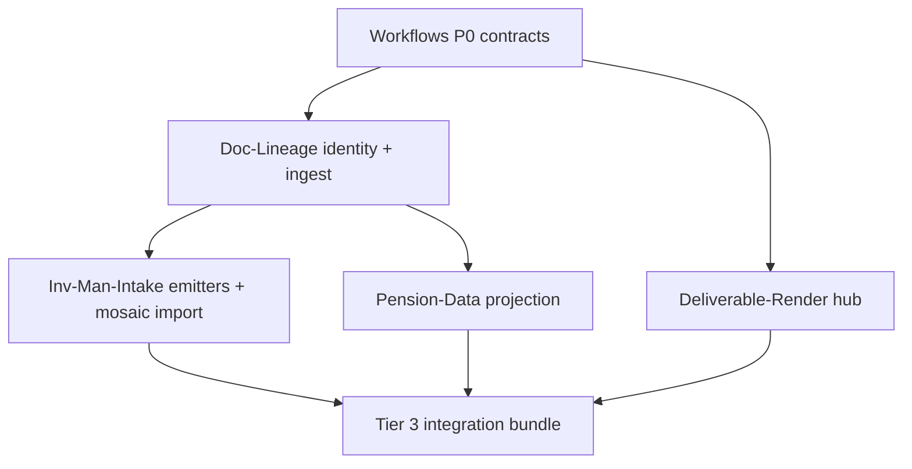

# B7 — Consolidated Program Plan v3 and Progress-Artifact Specification

**Date:** 2026-09-04 · **Author:** Cursor (Composer) · **Status:** Owner-actionable synthesis  
**Inputs:** `B2-gap-analysis.md`, `B3-interop-architecture.md`, `C-skill-curriculum.md`, R1–R7 briefs, `dossiers/00-INDEX.md`, `work-bundle/INFORMATION-REQUEST-RESPONSE.md`, `OWNER_NOTES.md`, `00-PROPOSAL.md`, `02-PLAN-v2.md`, `03-ENVIRONMENT-ANSWERS-IMPACT.md`  
**Owner answer in force:** Manager-mosaic capability defaults to **Inv-Man-Intake** (q-B7-program-plan-v3, 2026-09-04); drafted `Manager-Mosaic/` bodies remain unfiled.

---

## Executive judgment

Research is complete enough to build. The fleet’s failure mode is not missing ideas — it is missing **three horizontal substrates** every vertical brief assumes: conformant evidence/variable contracts (Workflows), a document mirror plus static output renderer (R4/R5), and a public/synthetic corpus manifest (R6). Work-environment answers overturned the “browser-only, no Python” model and confirmed mirror-first delivery; they did **not** overturn the hosting gap for LMS and TPP, which still need a local-first path plus an explicit IT accommodation case (`OWNER_NOTES.md`, `03-ENVIRONMENT-ANSWERS-IMPACT.md`).

**Strongest dissent:** Defaulting mosaic join storage to Inv-Man-Intake is weaker than B2/B6’s recommendation (new `Manager-Mosaic` repo or Manager-Database hub). Inv-Man-Intake is a diligence **producer** with page-pointer extraction, not a cross-source join store (`B6-FILING-REPORT.md` awaiting-owner note). A `Manager-Mosaic` repo already exists as scaffold (`clones/Manager-Mosaic/README.md`, created 2026-09-04). **Judgment:** Proceed with owner default — implement mosaic import as an Inv-Man-Intake module — but keep the wire format in Workflows `mosaic-core/v1` and treat Manager-Mosaic as rename-or-merge debt to resolve when the importer ships. **Confidence:** High on substrate ordering; medium on mosaic repo placement.

---

## 1. Settled decisions (with evidence and open items)

Each row is a **decision to proceed**, not a research finding. Dates are artifact publication dates unless noted.

| # | Decision | Evidence | Date | Open? | What closes it |
|---|----------|----------|------|-------|----------------|
| D1 | **Mirror-first document substrate** — the work library is already a synced folder tree (~3,800 PDFs, 480+ Excel, 170+ Word); build identity/manifest on top, not a greenfield mirror | `INFORMATION-REQUEST-RESPONSE.md` §C10; R4 §1 | 2026-09-04 | Partial | `document-mirror/v1` schema merged (Workflows #3373); `doc-mirror ingest` UX on Doc-Lineage #2 |
| D2 | **Content-hash document identity** — `document:<sha256>` primary; path is navigational only | R4 §2; Doc-Lineage #2 filed; OCR side-file precedent in work env §C9 | 2026-09-04 | No | — |
| D3 | **OCR is mandatory** — coverage without scanned-PDF pass is wrong, not incomplete | `INFORMATION-REQUEST-RESPONSE.md` §C8; Doc-Lineage #3 | 2026-09-04 | No | — |
| D4 | **Adopt work-tool field names verbatim** in `tracked-variable/v1` — consultant segment vocab (`VERBATIM`…`DROPPED`), T1/T2/T3 tiers, legal seven-column ledger, comms `fund/periods/entries/themes/documents/gaps` | `03-ENVIRONMENT-ANSWERS-IMPACT.md` §2; B3 §3; Doc-Lineage #4 | 2026-09-04 | No | — |
| D5 | **One Doc-Lineage repo** for legal + consultant diff engines; separate vocabulary files, not separate repos | B2 owner default #3; R1+R2 convergence | 2026-09-04 | No | — |
| D6 | **Federated interoperability** — Workflows owns wire formats; repos publish `identity-map/v1` cross-walks; no central resolver service | B3 §1.3; owner constraint in `02-PLAN-v2.md` §5 | 2026-09-04 | Partial | P1 integration falsification test (B3 §7) |
| D7 | **Deliverable-Render** owns shared HTML/DOCX/PPTX rendering; Doc-Lineage owns extraction/lineage only | R5 §2.2; `03-ENVIRONMENT-ANSWERS-IMPACT.md` §3 | 2026-09-04 | No | — |
| D8 | **Static deep-linked HTML** is primary work output; Word is sign-off authority; Excel for tabular refresh | R5 §3.2–3.3; work env §D delivery | 2026-09-04 | Partial | Deliverable-Render #2 link-integrity CI |
| D9 | **Local-first when possible; hosted design when required** — LMS and TPP file accommodation cases (B5 wave #580, #1513) | `OWNER_NOTES.md` hosting rule; B5 `WORK-ENV-WAVE-REPORT.md` | 2026-09-04 | Yes | IT response to accommodation brief |
| D10 | **stlite/WASM unverified at work** — not a publish path until probe passes | `INFORMATION-REQUEST-RESPONSE.md` §A1; Deliverable-Render #4 | 2026-09-04 | Yes | Deliverable-Render #4 probe result |
| D11 | **Manager-mosaic join in Inv-Man-Intake** (owner default) — not a fourth greenfield repo for now | ANSWERS q-B7-program-plan-v3 | 2026-09-04 | Yes | Importer module landed; reconcile with existing `Manager-Mosaic` scaffold |
| D12 | **Demand-driven audits** — refill at ≤25% agent-ready supply; no audit flood during travel window | `02-PLAN-v2.md` §4; `00-PROPOSAL.md` §6 Track D | 2026-09-04 | No | — |
| D13 | **Trip vertical parallel** — fixtures + Duffel/GTFS adapters; does not gate investment stack | B2 §3 Tier 4; R7 | 2026-09-04 | Partial | Owner supplies Duffel test account (trip-planner #1785) |

**Disagreements retained:**

- **R4 vs early plan v2:** Original RFI assumed browser-only/no Python; work answers prove local Python + COM + `file://` deep links (`03-ENVIRONMENT-ANSWERS-IMPACT.md` §1). **Judgment:** R4’s mirror-first polarity was correct; severity of “no runtime” was wrong.
- **B2 vs owner on mosaic repo:** B2-016 proposed `new-repo:Manager-Mosaic`; owner chose Inv-Man-Intake (D11). **Judgment:** Follow owner default; flag join-store coupling risk.
- **R3 vs B3 on graph DB:** R3 surveyed Kùzu/PROV; B2 rejects full graph stack for browser-local path. **Judgment:** B2/B3 win — SQLite + `mosaic-core/v1` until query patterns force graph DB (C module 26, conditional).

---

## 2. Build roadmap (dependency order)

Effort: **S** ≤1 week · **M** 1–3 weeks · **L** 4+ weeks. Constraint codes: **W1** local Python/COM · **W2** static HTML + `file://` page links · **W3** no server/DB today · **W4** OCR mandatory · **W5** GitHub-readable artifacts at work.

### 2A. Finish what is scaffolded

| Order | Item | Repo | Issue | Prereq | Effort | Constraint |
|------:|------|------|-------|--------|--------|------------|
| 1 | Backplane P0 contracts: `tracked-variable/v1`, `mosaic-core`, `document-mirror/v1`, `output-substrate/v1` | Workflows | #3371–#3374 | — | S | W5 |
| 2 | Fund-clause vocabulary v1 | Doc-Lineage | #6 | — | S | — |
| 3 | Content-hash identity + manifest (incl. doc-mirror CLI slice) | Doc-Lineage | #2 (wave 1) | WF #3373 | S | W2, W4 |
| 4 | Extraction adapter w/ OCR tri-state coverage | Doc-Lineage | #3 | #2 | M | W1, W4 |
| 5 | Adopt work ledger schemas in wire format | Doc-Lineage | #4 | WF #3371 | M | W2 |
| 6 | M1 ingest pipeline | Doc-Lineage | #8 | #6, #3 | L | W4 |
| 7 | Evidence-object emission at manifest boundary | Doc-Lineage | #9; IMI #949; PD #878 | WF #3371, #3 | M | W2 |
| 8 | Renderer-shell factor from `apps/web/` | Pension-Data | #882 | WF #3374 | M | W2 |
| 9 | Deep-linked HTML hub (no external resources) | Deliverable-Render | #2 (wave 1) | output-substrate draft | M | W2, W3 |
| 10 | Consultant section ontology | Inv-Man-Intake | #948 | WF #3371 | M | W2 |
| 11 | Evidence-object emitter (replace string refs) | Inv-Man-Intake | #949 | mosaic-core #3372 | M | W2 |
| 12 | Lineage/comparison engine (consultant tool port) | Doc-Lineage | #5 (B5) | #4, #6 | L | W1, W2 |

### 2B. New capability (not merely completing scaffold)

| Order | Item | Repo | Issue | Prereq | Effort | Constraint |
|------:|------|------|-------|--------|--------|------------|
| 13 | Public/synthetic fixture manifest | Doc-Lineage | #7 | artifact-manifest pattern | M | W5 |
| 14 | Blackline engine + synthetic mutation harness | Doc-Lineage | #10, #12 | M1 ingest | M | W5 |
| 15 | Identity-map + evidence projection emitter | Pension-Data | #881 | mosaic-core | M | W5 |
| 16 | `workspace-bundle.json` + report-spec profiles | Pension-Data #883; IMI #950 | renderer-shell | M | W2 |
| 17 | Triple-link HTML resolver | Doc-Lineage | #14 | document-mirror | S | W2 |
| 18 | Word memo renderer | Deliverable-Render | #5 | ledger schemas | M | W1 |
| 19 | Manifest-gated deck builder | Deliverable-Render | #3 (wave 1) | — | M | W1 |
| 20 | Store validator + evidence alignment | Deliverable-Render | #6 | evidence-object | S | W2 |
| 21 | **Mosaic manifest importer** (owner: Inv-Man-Intake module) | Inv-Man-Intake | *unfiled* (body at `issues/Manager-Mosaic/01`) | #3372, #881, #949, DL #8 | M | W2, W3 |
| 22 | CalPERS IC harvester → golden YoY pair | Pension-Data | #879 | public fixtures | M | W5 |
| 23 | EDGAR EX-10 LPA harvest | Doc-Lineage | #11 | #7 | M | W5 |
| 24 | LMS local-first export + IT accommodation brief | learning-management-system | #580 | — | M | W3 + hosted case |
| 25 | TPP local-first packet + IT accommodation brief | Travel-Plan-Permission | #1513 | — | M | W3 |
| 26 | Trip fixture adapters (parallel) | trip-planner | #1783–#1787 | — | S–M | W5 |

**Tier gates (from B2 §3):**

- **Gate 0:** Workflows validators pass on golden fixtures for all four P0 schemas.
- **Gate 1:** One synthetic mirror row validates; one public CalPERS PDF in manifest (#7).
- **Gate 2:** CalPERS 2025→2026 trust-level blackline >90% section pairing on manual audit (R2 objection test).
- **Gate 3:** One investment bundle: Pension-Data run + Inv-Man-Intake manifest + Doc-Lineage variables → static HTML with one-click page links (B2 Tier 3 gate).

---

## 3. Interoperability adoption sequence

Source: B3 §6. Adopt in order; each step has a **conformance check** runnable offline in Workflows CI.

| Phase | Repo | Contracts adopted | Deliverable | Conformance check |
|-------|------|-------------------|-------------|-------------------|
| **P0** | Workflows | Schema owner: `identity-map/v1`, `tracked-variable/v1`, `lineage-edges/v1`, `document-type-vocabulary/v1`, `document-mirror/v1` | Merged issues #3371–#3374; fixtures under `tests/fixtures/backplane/` | `validate_run_contract.py` + new `--identity-map`, `--tracked-variables`, `--lineage` flags; deliberate-break: integer `manager_id` in `identity_refs` **must fail** |
| **P1a** | Pension-Data | Emit standalone `evidence-object/v1`; publish `identity-map/v1` for pension/fund/manager tokens | #881 | Fixture `valid_tracked_variable.json` with embedded evidence; page locator present for PDF sources |
| **P1b** | Manager-Database | Export `identity-map/v1` after alias resolution | *not yet filed* (B2-019 Tier 4) | `crosswalk_join.json`: alias → `manager:cik_*` without integer leakage |
| **P2a** | Inv-Man-Intake | Map `doc_types` to fleet vocabulary; emit `tracked-variable/v1` | #948, #949 | Producer run ingests consultant field; joins on `ontology_key` + `entity_ref` |
| **P2b** | Doc-Lineage | Clause/section vocabularies; lineage NDJSON | #6, #8, #9 | `valid_lineage_chain.json` acyclic walk matches Pension-Data test vectors |
| **P3a** | Counter_Risk | Provider cross-walk publisher | *Tier 4* | `identity-map/v1` with `provider:` entries |
| **P3b** | learning-management-system | Consumer of `evidence-object/v1` + `tracked-variable/v1` | #580 local-first path | LMS ingest test: `SourceReference` links to fleet evidence file |

**Primary falsification test (B3 §7):** Pension-Data public Form 5500 extraction → `run-contract/v1` + one `tracked-variable/v1` + `identity-map/v1` → Inv-Man-Intake ingests and joins without manual slug edit. Failure after map publish means federation model insufficient.

**Current baseline:** 1/6 repos conformant on `run-contract/v1` (`00-INDEX.md` §2.2, §5.1). Target by Gate 3: **≥4 producers emitting** (Pension-Data, Inv-Man-Intake, Doc-Lineage, plus one of Manager-Database/Counter_Risk maps).

---

## 4. Skill program and tool-literacy first slice

Source: `C-skill-curriculum.md`. Bias: **comprehension over greenfield** — study CENTRAL fleet surfaces before building parallel abstractions.

### 4.1 Module sequence (summary)

| Phase | Weeks | Modules | Repo anchor |
|-------|-------|---------|-------------|
| Foundation | 1–3 | 0A Contracts, 0B Surfaces, 1 MCP, 2 Fleet CI | Workflows, Orchestrator |
| Observability & extraction | 4–7 | 3 LangSmith, 4 Structured extraction, 5 PDF eval, 13 Prompt versioning | Workflows, Inv-Man-Intake, LMS |
| Data & trust | 8–11 | 6 Entity resolution, 7 Data contracts, 8 ETL, 9 Diff/lineage | Counter_Risk, Pension-Data, Manager-Database |
| Agents & evaluation | 12–15 | 10 LangGraph, 12 Red-team evals, 14 HITL, 16 Agent security | TPP, Orchestrator, Pension-Data |
| Delivery | 16–21 | 11 RAG, 17–19 Static/packaging/browser | Manager-Database, PAEM, Counter_Risk, LMS |
| Fleet extensions | 22+ | 21 OTel, 22 MCP client, 23 Retrieval eval | Workflows, Manager-Database |

**Owner time cap:** ≤30 min/week FSRS reviews (`C-skill-curriculum.md` §4); study hours self-paced (~98 h total).

### 4.2 Tool-literacy loop — first slice (file-ready)

Implement in **Workflows** (extractor) + **learning-management-system** (consumer). Do not block on courses API or fleet-wide inventory.

| Step | Repo | Issue title (proposed) | Acceptance |
|------|------|----------------------|------------|
| 1 | Workflows | `repo_inventory_extract.py` for Workflows, Orchestrator, Manager-Database | Deterministic `artifacts/inventories/<repo>.json` with `surfaces`, `libraries`, `patterns`, `contracts`, `feeds_and_breaks`; CI diff on PR |
| 2 | learning-management-system | Import inventory JSON → `SourceReference` + draft `KnowledgeNode` | 10 nodes imported; each has `stable_locator` = git path + SHA |
| 3 | learning-management-system | Hand-author 10 Workflows prompts (draft → publish) | Prompts cite `SourceReference`; wrong answer becomes regression fixture |
| 4 | learning-management-system | `CapabilityTarget`: "Tool literacy: Workflows" | `/capability/gap` returns `weak_node_ids` after one deliberate-fail attempt |
| 5 | Workflows | CI hook: inventory drift flags stale `SourceReference` | Drift on `main` merge opens docs issue, not owner task |

**Question templates (fixed):** What is it? What feeds it? What breaks if wrong? How verify? (`C-skill-curriculum.md` §3.2.C)

---

## 5. Ninety-day measurement (three owner goals)

Horizon: 2026-09-04 → 2026-12-03 (~90 days). Each metric reads from a **real sink**, not a slide.

### Goal A — Skill (comprehension gap)

| Metric | 90-day target | Sink | Rationale |
|--------|---------------|------|-----------|
| Published capability estimates | **≥6 repos** with `CapabilityEstimate.score ≥ 0.7` on ≥50% of linked nodes | LMS DB/API: `POST /capability/estimates`, table `capability_estimates` | Proves tool-literacy loop is live, not curriculum PDF |
| FSRS reviews completed | **≥36** review sessions (≈3/week × 12 weeks) | LMS `EvidenceRecord` + `ReviewCardState` via `/learners/{id}/review-queue` | Matches 30 min/week cap (`C-skill-curriculum.md` §4) |

### Goal B — Infrastructure (mutual intelligibility)

| Metric | 90-day target | Sink | Rationale |
|--------|---------------|------|-----------|
| Backplane producers at `emitting` or `conformant` | **≥4 repos** (from 1 today) | `clones/Workflows/config/backplane_participants.json` `status` field | Direct read of interoperability adoption |
| P0 schema validators green | **5/5** satellite schemas in CI | Workflows `backplane-conformance.yml` + `tests/fixtures/backplane/` | Proves contracts landed, not just markdown |
| Filed B2/B5 issues closed | **≥20** merges linked to issues #3371–#3375, Doc-Lineage #2–#15, B5 wave | GitHub API `closedAt` + `intake-2026-09-04.log` | Fleet drain rate ~5.3/day baseline (`00-PROPOSAL.md` §3) — 20 is conservative vs flood risk |

### Goal C — Professional product (work-usable outputs)

| Metric | 90-day target | Sink | Rationale |
|--------|---------------|------|-----------|
| End-to-end integration bundle | **1** public-corpus bundle passing Gate 3 | Deliverable-Render CI link-integrity test + Doc-Lineage eval harness artifact | B2 Tier 3 gate — product, not schema |
| Deep-link integrity | **100%** of evidence rows open correct `file://` page in probe fixture | Deliverable-Render #2 test suite | Work env proved links work; fleet must not regress (`INFORMATION-REQUEST-RESPONSE.md` §A3) |
| Work-field conformance | **≥3** ledgers emit segment vocab + T1/T2/T3 without translation layer | Doc-Lineage #4 + #5 CI golden files vs work field names | `03-ENVIRONMENT-ANSWERS-IMPACT.md` §2 — names are load-bearing |

---

## 6. Progress-monitoring artifact specification

Owner request: interactive progress view from phone (`00-PROPOSAL.md` §5 Track F). Workers cannot publish interactive UI; **durable file + inbox** is v1; enhanced renderer is v2.

### 6.1 Artifact: `PROGRESS.md` (auto-generated)

**Location:** `research-program/PROGRESS.md` in Ready mirror (same cadence as `STATUS.md`).  
**Generator:** extend `program.py` tick — rewrite whole file each run (no append-only drift).

### 6.2 What it displays

| Panel | Fields | Source |
|-------|--------|--------|
| Program health | Phase, last checkpoint UTC, executors seen, paused flag | `queue.jsonl`, `CHECKPOINT.md`, `state.json` |
| Unit throughput | done / queued / parked / failed counts; 7-day velocity | `queue.jsonl` |
| §5 goal dashboard | Six numbers from §5 above with RAG status (red/amber/green) | LMS API, `backplane_participants.json`, GitHub API, CI badges |
| Fleet drain | Per-repo open `agents:auto-pilot` issues vs 25% refill threshold | GitHub API; logic from `02-PLAN-v2.md` §4 |
| Open owner questions | qid, default, expiry | `QUESTIONS.md` + inbox #553 |
| Next three build items | From §2A/B order skipping `done` issues | GitHub issue state |

### 6.3 What it must NOT do

1. **No manual updating** — if a human edits `PROGRESS.md`, next tick overwrites; edits belong in `OWNER_NOTES.md` or inbox comments.
2. **No growing queue** — display capped lists (top 10 blocked, top 5 risks); full queue stays in `queue.jsonl` only.
3. **No duplicate issue filing** — drain metrics are read-only; refill trigger fires audits, not new PROGRESS rows.
4. **No vanity counters** — exclude words-generated, commits, or LLM spend unless tied to a goal threshold.

### 6.4 How it stays current

| Mechanism | Interval | Owner touch |
|-----------|----------|-------------|
| `program.py` tick | hourly (Codex) + 3×/day (Claude) | None |
| GitHub mirror push | each tick | None |
| LMS capability pull | daily cron in engine | None |
| Stall detector | 6 h no `done` → inbox post | Optional phone ack |
| v2 interactive renderer | on owner return | One-time spec in Deliverable-Render consuming `progress-bundle.json` emitted alongside `PROGRESS.md` |

**Local-first v2:** `progress-bundle.json` + static HTML in Deliverable-Render (W2). **Hosted v2 (if needed):** internal GitHub Pages or static host on pension network; IT would need internal URL + read-only token to Ready mirror — fallback is markdown in GitHub mobile app (works today per `02-PLAN-v2.md` §6).

---

## 7. Risks and three most likely failure modes

| Risk | Severity | Countermeasure | Missing? |
|------|----------|----------------|----------|
| False alignment in consultant diff | High | Ontology gate before sentence alignment (B2 §7.1) | In Doc-Lineage #5 scope |
| Alias map staleness blocks joins | High | Scheduled `identity-map/v1` publish (B3 §7) | **Missing:** Manager-Database export issue not filed (Tier 4) |
| Backstop permalink instability | High | Mirror hash is truth; `source_system` best-effort (B3 §5.2) | — |
| Audit flood / latched gate | Medium | 25% refill trigger; no cap removed but one-in-flight per repo (`02-PLAN-v2.md` §4) | In place |
| LLM-generated LMS items wrong | Medium | Draft→publish + `SourceReference` (`C-skill-curriculum.md` §5) | In slice design |
| Synced-folder/git collision at work | Medium | Known scar; mitigation documented (`INFORMATION-REQUEST-RESPONSE.md` §E16) | **Missing:** owner answer on git-under-sync-folder permission |

### Three most likely program failures

1. **Substrate skipped for vertical features** — agents ship mosaic/trip/blackline before Workflows P0 merges.  
   **Countermeasure:** Gate 0 blocks downstream issues in filing order (`FILING_PLAN.md` waves). **Gap:** enforcement is process, not CI — add Workflows branch protection on consumer sync.

2. **Comprehension gap widens** — fleet ships faster than LMS loop.  
   **Countermeasure:** Tool-literacy slice §4.2; failed assessments → docs issues. **Gap:** slice not filed yet.

3. **Work integration never closes** — home repo passes CI but field names diverge from work tools.  
   **Countermeasure:** D4 verbatim schemas; Deliverable-Render validators. **Gap:** no scheduled work-side replay — owner must run one public bundle through work Python path quarterly.

---

## 8. Immediate owner actions (ordered)

1. **Hand no new decisions** unless reversing D11 — defaults cover mosaic placement, mirror location, LFS, vocabulary scope (`B2-gap-analysis.md` §6).
2. **Unblock filing:** merge Workflows #3371–#3374 first; fleet consumer sync before Doc-Lineage M1 agents pick up #8.
3. **RFI already answered** — treat `INFORMATION-REQUEST-RESPONSE.md` as authoritative for all work-side design.
4. **Phone channel:** inbox [Ready#553](https://github.com/stranske/Ready/issues/553); `STATUS.md` / `PROGRESS.md` on return.
5. **Resolve mosaic repo debt:** confirm Inv-Man-Intake module vs deprecating `stranske/Manager-Mosaic` scaffold.

---

*Word count: ~3,650. Grounded in cited artifacts. Checkpoint trail: `B7-program-plan-v3-default.CHECKPOINT.md`.*
