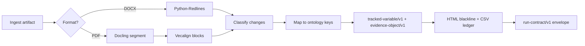

# Brief R2: Consultant-Report and Periodic-Communication Diffing

**Question.** How to reliably blackline year-over-year versions of long PDF/DOCX reports whose layout drifts, classify changes (boilerplate vs substantive vs numeric), and lift recurring sections into tracked variables so consultants and managers can be compared over time and against each other — and what a shared **Doc-Lineage** engine should offer sibling repos.

**Confidence.** High on the two-path diff architecture (native DOCX vs structured PDF) and on reusing Workflows `evidence-object/v1` for provenance. Medium on embedding-based sentence alignment as the default PDF aligner (layout drift can still fool it). Low on any single off-the-shelf tool covering consultant *section ontology* out of the box — that layer must be authored.

---

## 1. Problem framing

Recurring investment documents — consultant trust-level reviews, manager quarterly letters, DDQs, board agenda attachments — share a template skeleton but drift in layout, pagination, and wording. The owner’s work-side **Consultant Tracker** already blacklines consultant reports and turns recurring sections into comparable variables (HTML output). R2 asks what is buildable at home on public data, interoperable with the fleet, and portable to the planned **Doc-Lineage** repo (`clones/Doc-Lineage/README.md`).

**Hard constraint (assumed default):** work PC is browser + Office + file system, no terminal installs; outputs must link any derived fact to source document + page in one click; proprietary data never leaves the work perimeter.

---

## 2. Survey — diff engines

### 2.1 DOCX (preferred when Word source exists)

| Approach | FACTS | Fit for R2 |
|----------|-------|------------|
| **Python-Redlines** ([github.com/JSv4/python-redlines](https://github.com/JSv4/python-redlines)) | Generates native Word tracked changes (`w:ins`/`w:del`) without MS Word installed; Docxodus engine supports structure-aware `docxdiff` mode for tables/sections. | **Best DOCX blackline.** Produces reviewable `.docx` plus parseable revision XML. |
| **docx-trackdiff** ([github.com/stephenlzc/docx-trackdiff](https://github.com/stephenlzc/docx-trackdiff)) | Pure-Python tracked-changes output with seven automated verification checks. | Strong alternative; lighter dependency story than bundled C# binary. |
| **docx-redline / jubarte-redlines** ([pypi.org/project/docx-redline](https://pypi.org/project/docx-redline/1.0.2/), [pypi.org/project/jubarte-redlines](https://pypi.org/project/jubarte-redlines/)) | Word-level compare with similarity floor for unrelated paragraphs. | Useful when paragraph pairing breaks; jubarte adds deterministic revision metadata. |
| **python-docx + difflib** | Standard library diff on flattened paragraph text. | **JUDGMENT: reject as primary.** Misses table moves, headers, and native redline semantics; acceptable only as fallback telemetry. |

**JUDGMENT:** When either version is available as DOCX, run native tracked-changes diff first. Export PDF blackline from that result for the HTML review surface; do not treat PDF-to-PDF diff as equivalent fidelity.

### 2.2 PDF (default for board packets and scanned attachments)

| Approach | FACTS | Fit for R2 |
|----------|-------|------------|
| **pdfdelta** ([github.com/mli55/pdfdelta](https://github.com/mli55/pdfdelta)) | Layout-aware word diff; suppresses reflow noise; annotates additions/deletions on original pages. | Good **visual blackline** for born-digital PDFs; weak on variable extraction. |
| **kogo** ([pypi.org/project/kogo](https://pypi.org/project/kogo/1.0.1/)) | Page alignment + word-level diff + figure masking; browser and marked-PDF output. | Strong when slides/figures move between consultant decks. |
| **py-pdf-compare** ([pypi.org/project/py-pdf-compare](https://pypi.org/project/py-pdf-compare/2026.2.3/)) | Vector-preserving side-by-side report via PyMuPDF. | Better for regression testing than semantic classification. |
| **diffpdf** ([pypi.org/project/diffpdf](https://pypi.org/project/diffpdf/1.2.2/)) | Hash → text → pixel pipeline. | Fast gate; pixel stage too noisy for narrative classification. |
| **diff-match-patch** | Character-level diff on extracted strings. | **JUDGMENT:** use only *after* section alignment; raw character diff on full PDF text is unusable at report length. |

**JUDGMENT:** PDF diff is a **three-stage** problem, not a single tool call: (1) structural segmentation, (2) block/sentence alignment across versions, (3) classified diff within aligned blocks. Tools like pdfdelta solve stage 3 on flattened text; they do not replace stage 1–2.

### 2.3 Semantic alignment (layout drift)

| Approach | FACTS | Fit for R2 |
|----------|-------|------------|
| **Vecalign** ([aclanthology.org/D19-1136](https://aclanthology.org/D19-1136)) | Sentence embedding similarity + dynamic programming; linear-time approximation for long docs. | **JUDGMENT: recommended PDF aligner** between segmented blocks. |
| **sentweave** ([pypi.org/project/sentweave](https://pypi.org/project/sentweave/0.3.3/)) | In-memory Vecalign-style API; caller supplies multilingual encoder. | Same algorithm, easier Python integration. |
| **Needleman–Wunsch** ([en.wikipedia.org/wiki/Needleman%E2%80%93Wunsch_algorithm](https://en.wikipedia.org/wiki/Needleman%E2%80%93Wunsch_algorithm)) | Optimal global alignment; O(nm) memory. | **JUDGMENT: reject at full-document scale;** use on aligned sections only (<200 blocks). |

---

## 3. Survey — section segmentation

| Method | FACTS | Fit for R2 |
|--------|-------|------------|
| **Docling** ([github.com/docling-project/docling](https://github.com/docling-project/docling), [arxiv.org/html/2501.17887v1](https://arxiv.org/html/2501.17887v1)) | Layout model + TableFormer; emits `DoclingDocument` with `SECTION_HEADER`, `PARAGRAPH`, `TABLE`, reading order. | **JUDGMENT: default PDF segmenter** for public-corpus development. |
| **PyMuPDF structure** | Page text with coordinates; no native section hierarchy. | Needed for bbox locators in `evidence-object/v1`; insufficient alone for section IDs. |
| **unstructured** | Multi-format partition API. | Heavier ops surface; Docling already covers PDF+DOCX in one model stack. |
| **Pension-Data PDF pipeline** (`clones/Pension-Data/src/pension_data/parser/pdf_pipeline.py`) | Deterministic text/table/OCR fallback via `stranske_pdf_extract`; tuned for actuarial metrics, not narrative sections. | Reuse **parser stages and evidence anchors**, not section ontology. |

**JUDGMENT:** Segment into **ontology keyed blocks** (e.g., `consultant.performance_attribution`, `consultant.recommendation`, `manager.market_commentary`) using Docling headers + a data-file mapping table. Inv-Man-Intake’s **Standard Element Library** contract (`clones/Inv-Man-Intake/docs/contracts/standard_element_library.md`) is the right pattern: element IDs are data, detectors are pluggable — extend it from manager DDQ elements to consultant report sections.

---

## 4. Change classification

Proposed taxonomy (maps to owner’s boilerplate / substantive / numeric):

| Class | Detection signals (FACTS + rules) | Example |
|-------|-----------------------------------|---------|
| **formatting** | bbox shift only; token identity unchanged after normalization | Column reflow, font change |
| **boilerplate** | high similarity to template corpus or prior-year same section; legal/disclaimer fingerprints | Risk disclosures, consultant boilerplate |
| **numeric** | numeric token delta with stable surrounding text; table cell coordinate match | IRR, AUM, benchmark return |
| **substantive** | aligned block embedding similarity below threshold *and* token edit beyond stopwords | New recommendation language |

**JUDGMENT:** Classify **after alignment**, not on raw diff hunks. Numeric and boilerplate classes can be rule-first (fast, explainable); substantive needs embedding confirmation to avoid flagging synonym swaps as major. Pension-Data already normalizes consultant recommendation fields and board-decision status (`clones/Pension-Data/src/pension_data/extract/governance/consultants.py`) — reuse those normalizers when the section ontology key matches.

---

## 5. Units of work — representation

Two composable layers:

1. **Report-section ontology** (what recurring slot is this?) — stable keys like `consultant.trust_level.market_overview`, `consultant.private_equity.performance_review`, `manager.letter.thesis_update`. Data file + detectors, mirroring Inv-Man-Intake standard elements.

2. **Tracked variable instance** (what is this slot’s value in this document version?) — one row per `(ontology_key, document_version, entity_scope)`.

**JUDGMENT:** Do not adopt a full RDF/OWL legal ontology at v1. A **claim model** is enough: each variable is an asserted claim with typed value, confidence, classification, and supersession pointer — same shape serves R1 clauses (“withdrawal rights = quarterly, 90-day notice”) and R2 sections (“recommendation = maintain overweight PE”).

---

## 6. Fleet comparison — what exists vs what Doc-Lineage must add

| Repo | Already parses | Missing for R2 diff/lineage |
|------|----------------|----------------------------|
| **Pension-Data** | Public pension PDFs; consultant engagements → `staging_consultant_engagements` (`README.md`); artifact supersession via checksum (`src/pension_data/ingest/artifacts.py`); evidence refs with page/section (`src/pension_data/extract/common/evidence.py`). | No cross-version blackline; no section-level variable schema; consultant extraction is governance-disclosure oriented, not full consultant PDF narrative. |
| **Inv-Man-Intake** | Manager packet intake; document versioning by `(fund_id, file_name)` (`docs/contracts/core_schema.md`); field provenance + corrections (`docs/contracts/provenance_history.md`); DOCX/PDF/PPTX roles (`docs/contracts/intake_contract.md`). | No YoY diff; standard element library is stub-only; aliases unset (`identity-map-conventions.md` notes). |
| **Counter_Risk** | Monthly counterparty statements from Excel/PDF inputs (`README.md`); mapping diff for name registry (`src/counter_risk/reports/mapping_diff.py`). | Statement diff is tabular/counterparty-specific, not narrative report sections. |
| **Doc-Lineage** | Scaffold only (`README.md`); contracts copied from Workflows. | Everything: segment, align, classify, emit. |

**Doc-Lineage should offer sibling repos:**

- **Ingest hook:** content-addressed artifact IDs compatible with Pension-Data supersession semantics.
- **Family detection:** cluster documents by template fingerprint (header/footer hash + section outline vector).
- **Alignment service:** DOCX redline path + PDF semantic alignment path.
- **Variable extraction:** ontology-driven section spans → `evidence-object/v1` payloads.
- **Review artifacts:** static HTML blackline + CSV/JSON variable ledger with `file://` or SharePoint page anchors.
- **Run envelope:** `run-contract/v1` + `artifact-manifest/v1` per Workflows contracts (`clones/Workflows/docs/contracts/schemas/evidence-object-v1.schema.json`).

**JUDGMENT:** Pension-Data should **not** grow a second diff engine; it should **consume** Doc-Lineage outputs into staging tables. Inv-Man-Intake should register manager letters/DDQs and attach Doc-Lineage variable IDs to `extracted_fields`. Counter_Risk stays out of narrative diff unless counterparty narrative letters are in scope later.

---

## 7. Minimum tracked-variable representation (R1 ∩ R2)

A single JSON/CSV row shape satisfies legal clauses and report sections:

```json
{
  "schema_version": "tracked-variable/v1",
  "variable_id": "var:<sha256-prefix>",
  "ontology_key": "legal.withdrawal.redemption_frequency",
  "document_id": "artifact:…",
  "entity_ref": "manager:cik_0001067983",
  "period": "2025-Q1",
  "value_text": "Quarterly redemption with 90 days notice",
  "value_structured": null,
  "change_class": "substantive",
  "confidence": 0.91,
  "supersedes_variable_id": "var:…",
  "evidence": {
    "schema_version": "evidence-object/v1",
    "evidence_id": "ev:…",
    "fact_ref": "legal.withdrawal.redemption_frequency",
    "source_id": "artifact:…",
    "method": "parser",
    "excerpt": "…bounded quote…",
    "locator": { "page": 42, "section": "Withdrawals" }
  }
}
```

**FACTS:** Workflows `evidence-object/v1` already requires `method`, `excerpt`, and structured `locator.page` (`clones/Workflows/docs/contracts/schemas/evidence-object-v1.schema.json`). Pension-Data’s local `EvidenceReference` supports page and section hints but does not yet emit standalone evidence objects (`src/pension_data/extract/common/evidence.py`).

**JUDGMENT:** Doc-Lineage owns `tracked-variable/v1` as a thin wrapper around one evidence object + lineage fields. R1 and R2 differ only in **ontology_key vocabulary files**, not wire format. Publish vocabularies as JSON data in Doc-Lineage; Workflows registry references them.

---

## 8. Public test corpus

**Primary source:** US public pension investment committee materials — agenda items with attached consultant reports.

| Source | FACTS | Use |
|--------|-------|-----|
| **CalPERS Investment Committee** | Recurring “Trust Level Review – Consultant Report” agenda items with Wilshire/Meketa attachments ([calpers.ca.gov/documents/202503-invest-agenda-item06a-00-a](https://www.calpers.ca.gov/documents/202503-invest-agenda-item06a-00-a/download?inline=), [202603 item](https://www.calpers.ca.gov/documents/202603-invest-agenda-item03a-00-a-mar17/download?inline=)). | YoY pair: Mar 2025 vs Mar 2026; same section outline, drifting body text. |
| **CalPERS transcripts** | Open session transcripts reference the same consultant report items ([202503 transcript](https://www.calpers.ca.gov/documents/202503-invest-transcript/download?inline=)). | Cross-check section titles vs spoken summary (negative test for over-extraction). |
| **Pension-Data source bootstrap** | `scripts/source_collection/build_pension_sources.py` builds local source inventory under `doc/Sources/` (`README.md`). | Extend to harvest IC agendas across 5–10 large plans (CalPERS, CalSTRS, NYCERS, Texas TRS, OPERS). |

**JUDGMENT:** Start with **one consultant family** (CalPERS trust-level Wilshire performance review) for golden tests; add Meketa private-asset attachments as a second family with table-heavy diff. Manager letters are harder to collect publicly — use Inv-Man-Intake fixture bundles for manager-side tests until a public letter corpus is curated.

**Synthetic corpus:** Template DOCX with controlled numeric/substantive/boilerplate edits for CI; never commit proprietary Backstop exports.

---

## 9. Recommended pipeline (minimum viable Doc-Lineage)



**JUDGMENT:** This is buildable in phases on home hardware with public PDFs only. Phase 1 (S): DOCX redline + HTML renderer + one golden CalPERS pair. Phase 2 (M): PDF segmentation + alignment + classification. Phase 3 (M): ontology data files + cross-consultant comparison views.

---

## 10. Ranked candidates

| Rank | What | Why it matters | Effort | Prerequisite | Disposition |
|------|------|----------------|--------|--------------|-------------|
| 1 | **Doc-Lineage core pipeline** (segment → align → classify → emit) | Single shared engine for Consultant Tracker, legal lineage, and fleet repos | **L** | Workflows contracts stable | **new-repo:Doc-Lineage** |
| 2 | **`tracked-variable/v1` schema + ontology data files** | Unifies R1 clauses and R2 report sections | **S** | evidence-object/v1 | **extend:Workflows** |
| 3 | **Python-Redlines DOCX path** | Highest-fidelity blackline when Word source exists | **S** | none | **adopt-ready-made:python-redlines** |
| 4 | **Docling PDF segmentation adapter** | Layout-stable section boundaries for consultant PDFs | **M** | Python 3.10+ runtime | **adopt-ready-made:docling** |
| 5 | **Vecalign/sentweave alignment layer** | Handles pagination/paragraph drift between years | **M** | Docling segments | **adopt-ready-made:sentweave** |
| 6 | **CalPERS IC public corpus harvester** | Repeatable golden tests without proprietary data | **M** | Pension-Data source_collection | **extend:Pension-Data** |
| 7 | **Consultant section ontology in Standard Element Library shape** | Comparable variables across consultants/managers | **M** | ontology data files | **extend:Inv-Man-Intake** |
| 8 | **Pension-Data staging import for Doc-Lineage variables** | Surfaces consultant variables next to actuarial facts | **S** | Doc-Lineage CSV emit | **extend:Pension-Data** |
| 9 | **pdfdelta visual annotation layer** | Page-faithful blackline PDF for IC reviewers | **S** | aligned text diff | **adopt-ready-made:pdfdelta** |
| 10 | **Pixel-only PDF diff (diffpdf/compare-pdf)** | Flags any visual change | **S** | none | **reject** — too noisy for classification |
| 11 | **Office/Word automation as runtime dependency** | Native Compare in installed Word | **S** | Windows + Word | **reject** — violates no-install constraint model |

---

## 11. Open questions for the owner

1. **Primary source format at work:** Are consultant reports stored as DOCX, PDF, or both in Backstop? *(Default assumed: PDF attachments on board agendas; DOCX path opportunistic when source file available.)*

2. **Identity authority for cross-tool joins:** With Manager-Database no longer absolute, should consultant entities resolve via Pension-Data `build_canonical_stable_id` or a Doc-Lineage-local alias table? *(Default: Pension-Data for `pension:` and consultant names; Doc-Lineage carries unresolved aliases with `confidence < 1`.)*

3. **Scope of first ontology:** Trust-level consultant reviews only, or include manager quarterly letters in v1? *(Default: consultant IC reports first; manager letters reuse schema but separate ontology file.)*

4. **Work-side HTML tools:** Will the existing Consultant Tracker HTML be replaced by Doc-Lineage output or fed by Doc-Lineage CSV/JSON? *(Default: Doc-Lineage emits compatible HTML + variable ledger; migration is a separate work-PC task.)*

---

## 12. Strongest objection (evaluator stance)

The biggest risk is **false alignment**: Vecalign-style embedding alignment will happily match paraphrased boilerplate across sections if headers were misparsed. **Mitigation:** require section ontology match before sentence alignment; fail closed to manual review queue when header confidence is low. I would change this judgment if a golden CalPERS 2025→2026 pair shows >95% correct section pairing with Docling alone.

---

NEW_CANDIDATES=11
